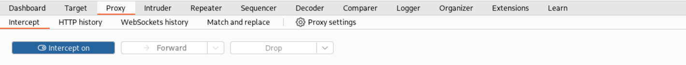
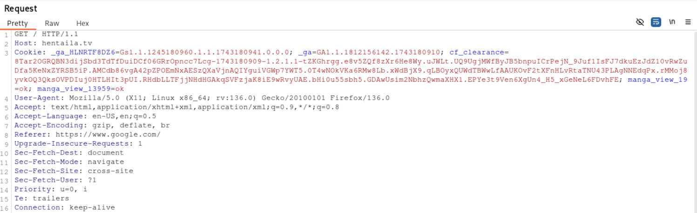

# INTERCEPTAR PETICIONES WEB

Interceptar peticiones web consiste en capturar las solicitudes HTTP o HTTPS que salen del navegador web o una aplicación hacia el servidor de destino. Esto nos permite modificar parámetros como:

* **Métodos HTTP**: GET, POST, PUT, DELETE, etc.
* **Headers**: Cookies, User-Agent, Content-Type, Referer, etc.
* **Parámetros y carga útil**: Datos enviados en formularios o en el body de la solicitud.

## Interceptar peticiones web con Burp Suite
!!! warning "Configuración previa del navegador/aplicación"
    Es importante asegurarse de haber realizado la configuración pertinente para el proxy en el navegador o aplicación que se este utilizando.

Para interceptar las peticiones web en Burp Suite navegamos a la pestaña **Proxy > Intercept** y presionamos el botón de **Intercept on/off** asegurandonos que este en **on**.

Ahora podemos ir al navegador/aplicación que tenemos configurado para el proxy y empezar a interceptar peticiones.

## Interceptar peticiones web con ZAP
!!! warning "Configuración previa del navegador/aplicación"
    Es importante asegurarse de haber realizado la configuración pertinente para el proxy en el navegador o aplicación que se este utilizando.
