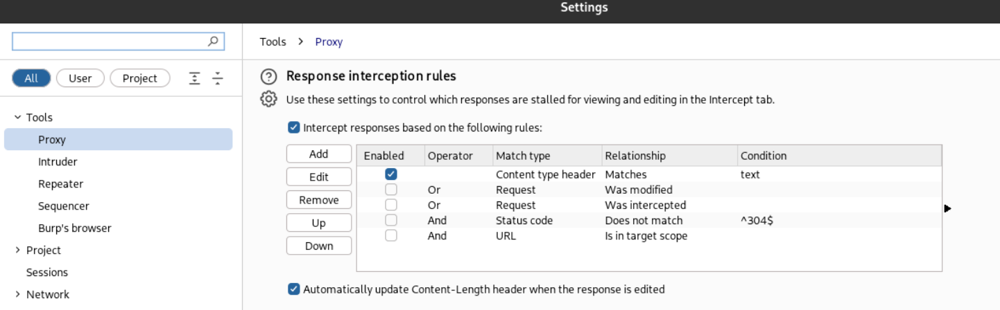

# INTERCEPTAR RESPUESTAS WEB

Interceptar las respuestas web significa capturar y analizar los datos que el servidor devuelve al cliente y tener la posibilidad de modificarlos. Esto nos permite modificar como luce la página web, como habilitar o deshabilitar ciertos campos ocultos.

## Interceptar respuestas web en Burp Suite
En Burp Suite tenemos que habilitar la intercepción de respuestas, para ello iremos a la pestaña de **Proxy > Intercept > Proxy Settings**.

Y en **Tools > Proxy** buscaremos el apartado que diga **Response interception rules** habilitando la opción `Intercept responses based on the following rules`. En este apartado podemos también modificar las reglas de intercepción de respuestas web.

Ahora podemos interceptar las respuestas del servidor y modificarlas antes de que lleguen al cliente.

Y como podemos ver, ahora cuando damos **Forward** aparece con el título que hemos modificado en la respuesta.

## Interceptar respuestas web en ZAP