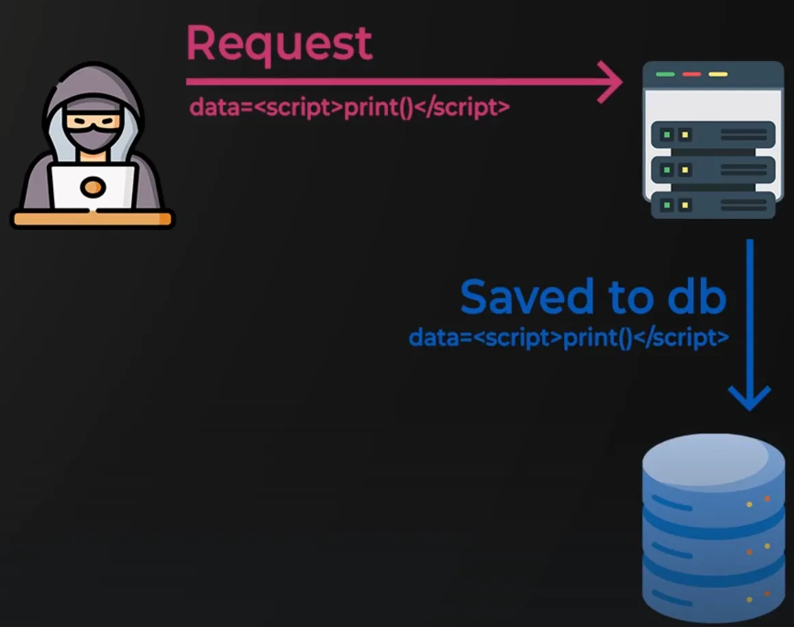
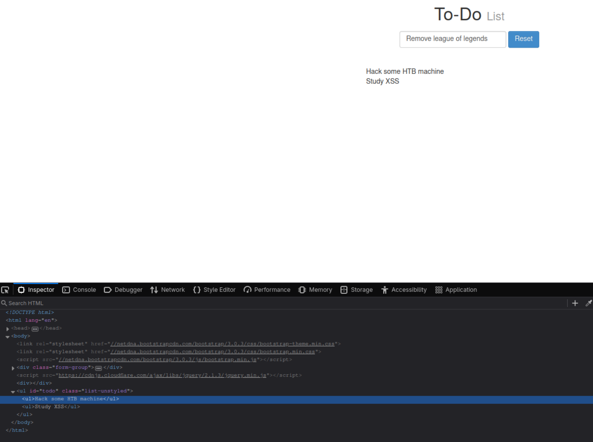
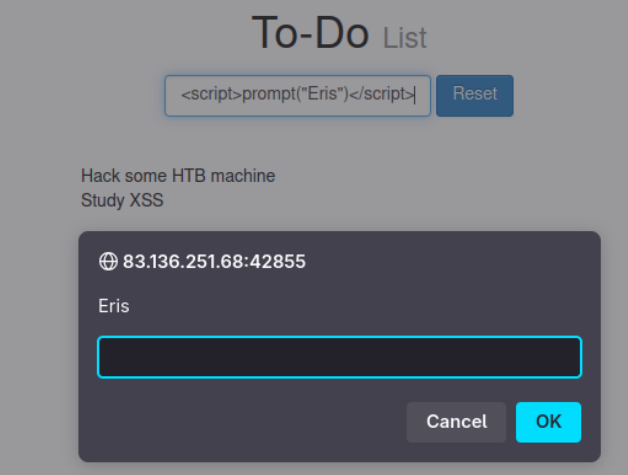
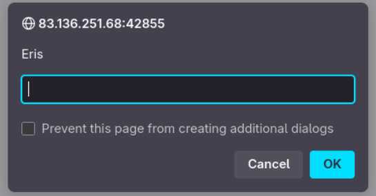

# XSS ALMACENADO

Este tipo de XSS es el más crítico. Explotar esta vulnerabilidad permite que cualquier usuario que visite la página ejecute el payload automáticamente.

En el siguiente ejemplo, podemos ver que es una aplicación simple que muestra en la página el texto que le pasamos. Como podemos ver en el código HTML agrega un `<ul> ITEM_TEXT </ul>` a una lista. Y si reiniciamos la página, esos items que agregamos a la lista aún siguen en el código HTML y se muestran en el navegador, indicando que de alguna manera se sobrescribe el código HTML desde el lado del servidor.

!!! tip "Cross-domain IFrames"
    Muchos navegadores web modernos usan **cross-domain IFrames** que gestionan el user input, asi que aún si un formulario web es vulnerable a XSS, no será una vulnerabilidad en la aplicación web principal. Podemos pasar el payload `` para revelar la URL dónde esta siendo ejecutado, y confirmará que formulario es el vulnerable, en caso de que se este usando IFrame.

!!! warning "Navegadores modernos y función alert()"
    Muchos navegadores web modernos bloquearan la función `alert()` para ubicaciones especificas, podemos intentar otros payloads básicos para verificar la existencia de XSS como ``.

Si intentamos inyectar un payload como `` podemos ver que se ejecuta la función `prompt` correctamente, indicando mala sanitización del input y vulnerable a algún tipo XSS.

Y podemos identificar que el tipo de vulnerabilidad es **XSS Almacenado** si reiniciamos la página y se ejecuta automáticamente nuestra función `prompt`.

---

