# INTRODUCCION A LOS WEB PROXIES

Un **web proxy** actúa como un intermediario entre el cliente (navegador web o aplicación) y el servidor de destino. En lugar de conectar directamente, la petición se redirige al proxy, que luego la reenvía al servidor. En hacking la habilidad de interceptar y modificar peticiones y respuestas es fundamental.

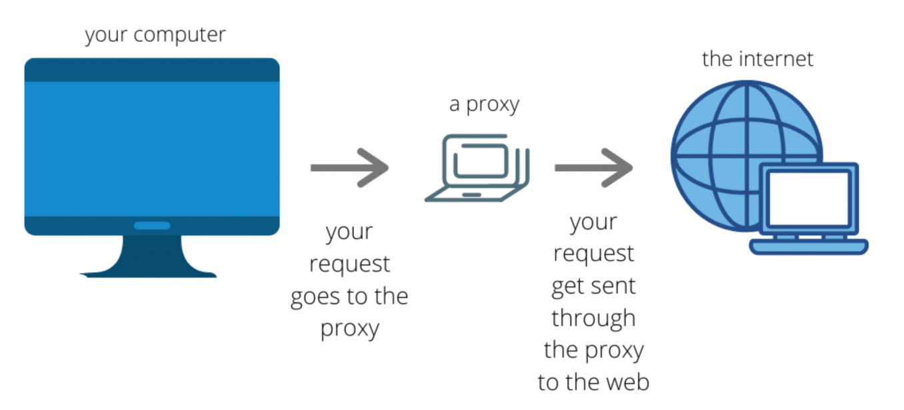

Los dos web proxies más comunes son **Burp Suite** y **Zed Attack Proxy (ZAP)**.

---

## Navegador web preconfigurado en Burp Suite
Tanto Burp Suite como ZAP vienen con un navegador preconfigurado con la configuración correspondiente del proxy y de los certificados CA.

Para acceder al navegador configurado de **Burp Suite** vamos a ir a la pestaña **Proxy > Intercept** y en la esquina superior derecha se encuentra un botón que dice **Open browser**.

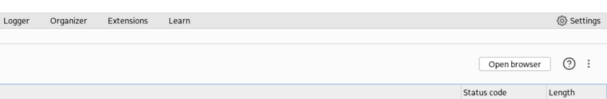

Esto abrirá su navegador predeterminado que suele ser un **chromium**.

---

## Navegador web preconfigurado en ZAP

Para abrir el navegador web preconfigurado en ZAP buscaremos el icono de firefox, usualmente es el último o penúltimo de los iconos.

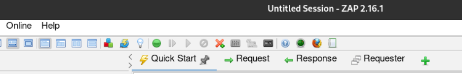

Esto abrira su navegador preconfigurado y nos aparecerá un mensaje de bienvenida como el siguiente:

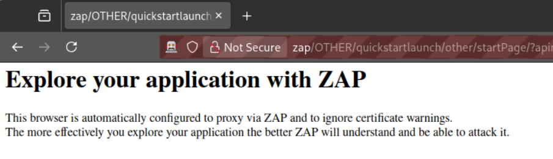

---

## Uso del plugin Foxy Proxy (Burp Suite y ZAP)

!!! note "Configuración manual"
    Si bien es posible configurar manualmente cualquier navegador web para que se use como proxy, es más conveniente usar plugins ya programados para hacer este proceso más fácil. 

!!! info "Puerto por defecto"

    Tanto Burp Suite como ZAP utilizan el puerto 8080 por defecto, pero en ambos programas se puede configurar para usar otro puerto.

Buscamos el plugin **FoxyProxy** para el navegador que estemos usando y la instalamos.

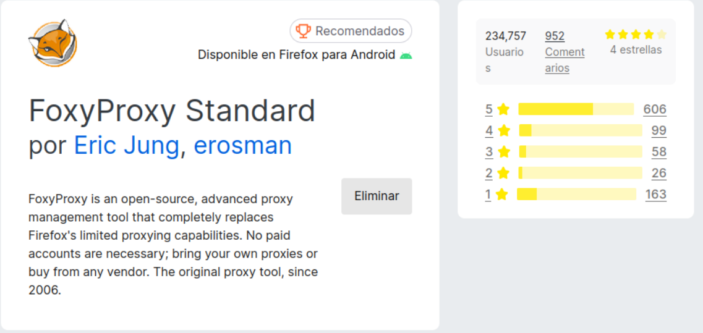

Vamos a configurar ahora el proxy llendo a **Options** y se nos abrirá una nueva ventana con varias opciones para FoxyProxy.

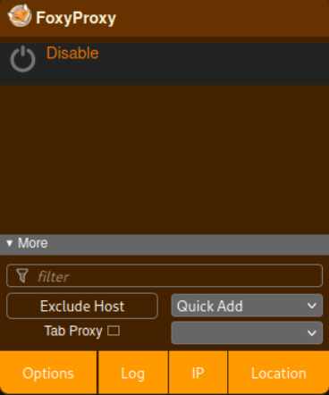

 Iremos a la pestaña **Proxies** y le daremos al botón **Add**. Configuramos el proxy como lo necesitemos y le damos a **Save**.

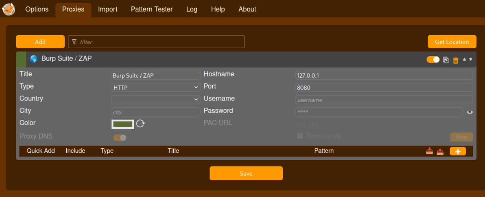

Ahora podemos habilitar y deshabilitar rápidamente si el navegador web usa el proxy o no desde el plugin.

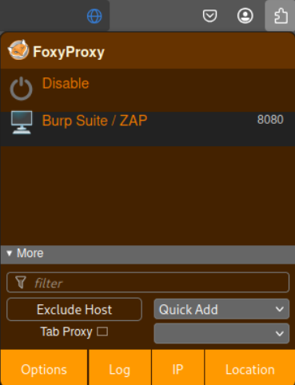

---

Algunas conexiones HTTPS pueden fallar si no tenemos instalado los certificados CA del web proxy correspondiente. 

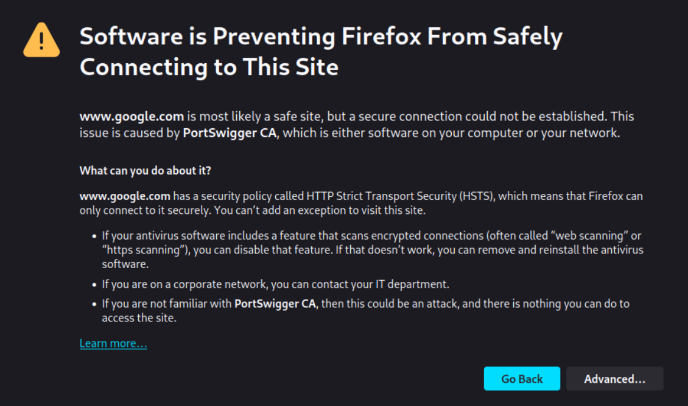

---

## Descargar certificados CA de Burp Suite

Para descargar el certificado CA de Burp Suite vamos a ir al enlace `http://burp` y en la parte superior derecha se encuentra un botón **CA Certificate** al cliquear en el se descargará el certificado.

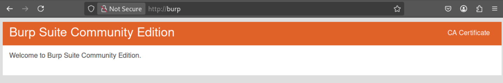

---

## Instalar los certificados CA en Firefox

Para instalar estos certificados en Firefox vamos a ir a la url `about:preferences#privacy` y en la parte de **Security** buscaremos el apartado de **Certificates**. 

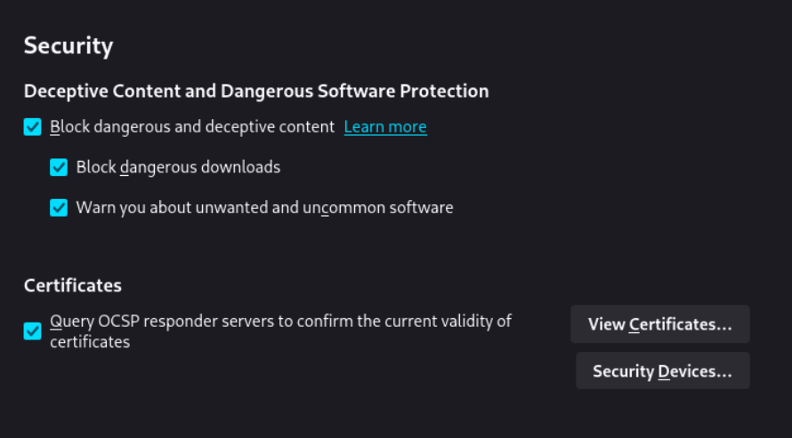

Daremos click a **View Certificates...** y en la ventana que se nos abra iremos a la pestaña **Authorities**.

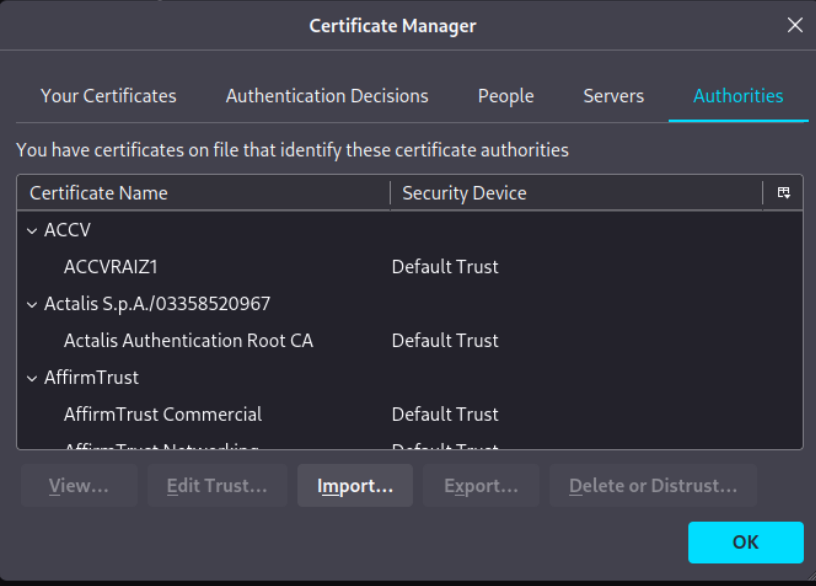

Clickearemos el botón **Import...** y seleccionamos el certificado CA del web proxy. Esto nos pedirá que si deseamos confiar en el CA, seleccionamos ambas casillas y damos **OK**.

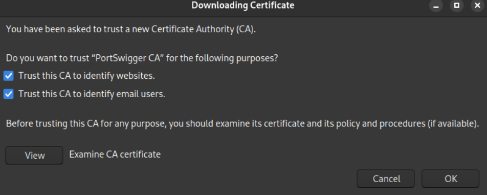

---